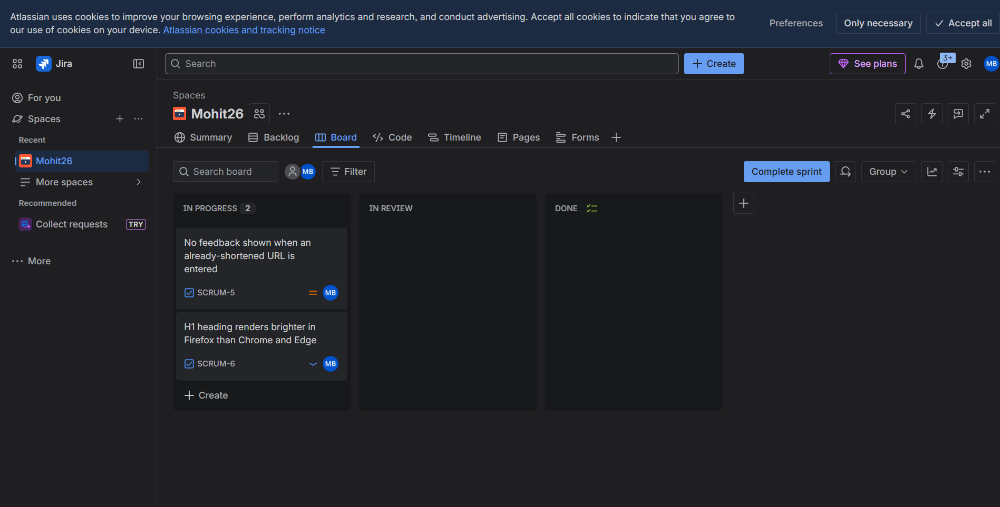

# Django URL Shortener

**Live app:** [Here!](https://url-shortner-django-1.onrender.com/)

A simple **URL Shortener web application** built with **Django**.
It allows users to convert long URLs into short, shareable links through integration with the **Bitly API**.

The application focuses on a **clean interface, smooth workflow, and strong validation**, making it easy for users to quickly shorten and share links.

---

# Features

### URL Shortening

Enter any valid URL and instantly receive a shortened link.

### Clickable Results

Generated links are clickable and open in a new browser tab.

### Reset Functionality

Quickly clear the form and result to start a new shortening request.

### Input Validation

Prevents empty submissions and validates URL format before sending a request.

### Error Handling

Displays clear messages if the URL cannot be shortened due to:

* invalid URL format
* API errors
* unexpected failures

### Responsive Interface

Designed to adapt across screen sizes, improving usability on mobile and tablets.

### Minimal UI

A simple and distraction-free layout focused entirely on the core task: **shortening links quickly**.

---

# Tech Stack

## Backend

* **Django 5.2.4** — web framework
* **Python 3.12** — programming language
* Django built-in tools for routing, forms, and template rendering

## Frontend

* **HTML5** — semantic markup
* **CSS3** — responsive styling
* **Django Templates** — dynamic rendering

## API Integration

* **Bitly API** — generates shortened URLs
* Access token stored securely using **environment variables**

## Database

* **SQLite** (default Django database) for local development
* Easily replaceable with:

  * PostgreSQL
  * MySQL
  * other Django-supported databases for production

## Development Tools

* `.env` for environment variable management
* `.gitignore` to exclude unnecessary files (`__pycache__`, database files, etc.)
* **Git + GitHub** for version control and hosting

---

# QA Testing

The project was **manually tested against 21 test cases** covering core functionality and edge cases.

## Test Summary

| Metric           | Result |
| ---------------- | ------ |
| Total Test Cases | 21     |
| Passed           | 19     |
| Failed           | 2      |
| Pass Rate        | 90.4%  |
| Bugs Found       | 2      |

---

## Areas Tested

* URL shortening functionality

  * valid URLs
  * invalid URLs
  * empty input
  * edge cases

* Link behaviour

  * clickable result
  * opens in a new tab
  * correct redirect behaviour

* Form functionality

  * reset button
  * form state management

* Input validation

  * empty fields
  * missing URL scheme
  * special characters
  * potential XSS input

* Error handling and user feedback

* Responsive UI testing

  * mobile breakpoint (375px)
  * tablet breakpoint (768px)

* Cross-browser testing

  * Chrome
  * Firefox
  * Edge

---

# Bugs Found

### BUG_001 — Silent failure on already-shortened URL

**Severity:** Medium

If a user pastes an existing Bitly link and clicks **Shorten**, the application returns no output and no error message, leaving the user without feedback.

---

### BUG_002 — H1 rendering inconsistency in Firefox

**Severity:** Low

The main `h1` heading appears slightly brighter in Firefox compared to Chrome and Edge, likely due to a font-rendering difference in CSS.

---

# Observations

### OBS_001 — API rate limit reached during testing
**Severity:** Low (Observation)  
During test execution, the Bitly free tier limit of 5 links per month 
was reached. This is a third-party API constraint, not an application 
bug. However, the app currently shows no user-friendly message when 
the API limit is hit — it may silently fail or show a generic error.

# Test Artifacts

Full test case documentation:

```
test-cases/qa_test_cases.xlsx
```
## Screenshots

